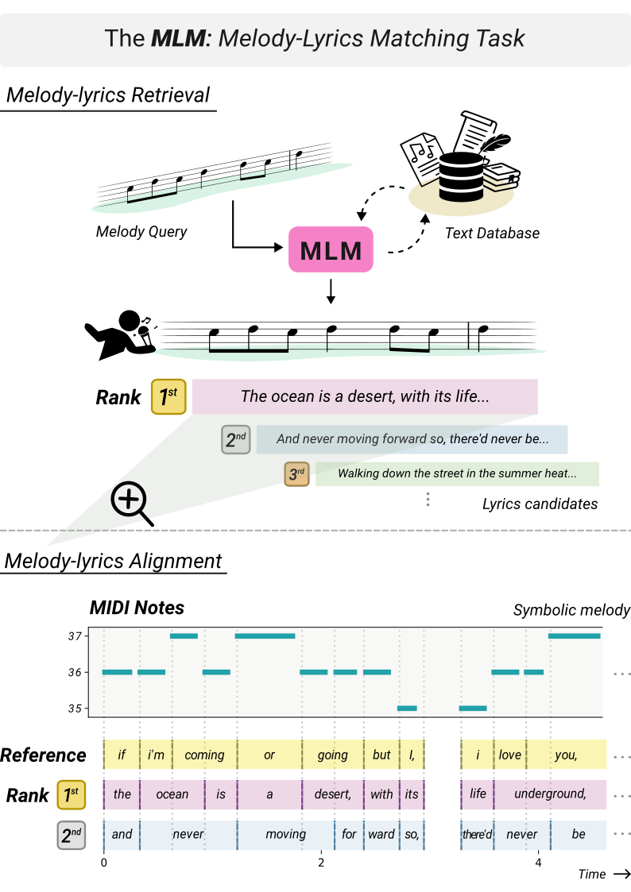

# MLM: Melody-Lyrics Matching with Contrastive Alignment Loss

Github repository for the following paper:

Changhong Wang, Michel Olvera, and Gaël Richard. Melody-Lyrics Matching with Contrastive Alignment Loss, Preprint HAL:https://hal.science/hal-05191876, 2025. (Under Review)

To supplement Figure 7 in the paper, we provide a demo webpage with more examples of the matched results: https://changhongw.github.io/publications/mlm.

We will open-source the complete code once the paper is accepted. Please feel free to contact the author at changhong.wang@telecom-paris.fr if you have any questions on the paper.
