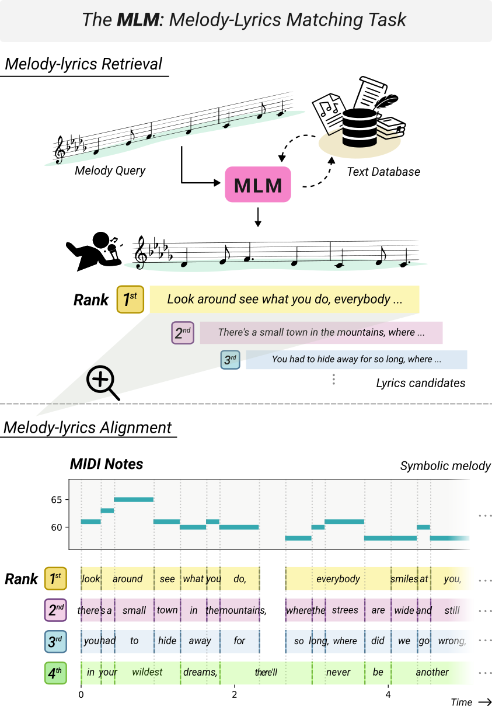

# MLM: Melody-Lyrics Matching with Contrastive Alignment Loss

<p align="center">
📔 <a href="https://www.arxiv.org/abs/2508.00123">ArXiv</a> &nbsp;&nbsp;
📔 <a href="https://hal.science/hal-05191876">HAL</a> &nbsp;&nbsp;
🎵 <a href="https://changhongw.github.io/publications/mlm">Demo</a> &nbsp;&nbsp;
🎧 <a href="https://perso.telecom-paristech.fr/chawang/webMUSHRA/">Listening Test</a>
</p>

Github repository for the following paper:

> Changhong Wang, Michel Olvera, and Gaël Richard. "[Melody-Lyrics Matching with Contrastive Alignment Loss](https://www.doi.org/10.1109/TASLPRO.2026.3703164)". _IEEE Transactions on Audio, Speech and Language Processing_, 2026.

<p align="center">

</p>

To supplement Figure 8 in the paper, we provide a [demo webpage](https://changhongw.github.io/publications/mlm) with more examples of the matched results.

## Project Structure

```text
mlm/
├── configs/
│   ├── experiment/
    ...
│   └── eval.yaml
├── outputs/
├── preprocessing/
  └── DALI_English_songs.csv
├── result_analysis/
├── src/
│   ├── data
│   ├── losses
│   ├── models
│   ├── utils
│   ├── train.py
│   ├── pred.py
│   └── eval.py
├── ckpts/
├── .project-root
├── environment.yml
└── README.md
data/
├── DALI/
├── DALI50/
└── DALI_features.hdf5
```

We provide pre-extracted feature of the DALI English subset (`DALI_features.hdf5`) and the pre-trained models at this [link](https://drive.google.com/drive/folders/1NOQSZ1R8dau2qQdAuy-5DES-Gjl-mfzo?usp=sharing). Data is recommended to be assembled in the `data` folder and pre-trained models in the `mlm/ckpts/` folder.

## Dependencies

We recommend using Conda environment to install dependencies:

```sh
git clone https://github.com/changhongw/mlm.git
conda env create -f environment.yml
conda activate mlm
```

## Data
- **Training and validation data**: [DALI V2](https://github.com/gabolsgabs/DALI).
- **Evaluation data**: we created **_DALI50_**, a subset of 50 songs randomly selected from DALI V2. The song ids are included in the `preprocessing/DALI_English_songs.csv`. The corresponding note-syllable annotations will be open-sourced soon.

## Preprocessing
- Run `preprocessing/2_DALI_feature_extract.py` to pre-extract melody and lyrics feature to accelerate training.

## Training

Example training for `Seg12` with SDTW `gamma=0.01` and length-informed `regularization_weight=0.25`:

```sh
python src/train.py experiment=train +experiment.data.seg_lnum=12 +experiment.model.contrastive_loss_fn.gamma=0.01 +experiment.model.contrastive_loss_fn.regularization_weight=0.25
```

## Inference

Example inference for `Seg12` with SDTW `gamma=0.01` and length-informed `regularization_weight=0.25` on the evaluation set.

```sh
python src/eval.py experiment=eval +experiment.data.seg_lnum=12 +experiment.model.contrastive_loss_fn.gamma=0.01 +experiment.model.contrastive_loss_fn.regularization_weight=0.25 +ckpt_path=ckpts/Seg12_gamma001a025.ckpt
```

## Acknowledgement

- Our Soft Dynamic Time Warping (SDTW) implementation is build upon: [Maghoumi/pytorch-softdtw-cuda](https://github.com/Maghoumi/pytorch-softdtw-cuda) and [groupmm/weightedSDTW](https://github.com/groupmm/weightedSDTW)
- We use Transformer with relative positional representation from [gwinndr/MusicTransformer-Pytorch](https://github.com/gwinndr/MusicTransformer-Pytorch/blob/master/model/rpr.py)
- We use the [Penn Phonetics Toolkit syllabifier](https://babel.ling.upenn.edu/phonetics/old_website_2015/p2tk/index.html) for syllabification.

## Citation

If you use our work in your research, please cite our paper:

```
@article{wang2025melody,
  title={Melody-Lyrics Matching with Contrastive Alignment Loss},
  author={Wang, Changhong and Olvera, Michel and Richard, Ga{\"e}l},
  journal={IEEE Transactions on Audio, Speech and Language Processing},
  volume={34},
  pages={3560-3571},
  year={2026},
}
```
